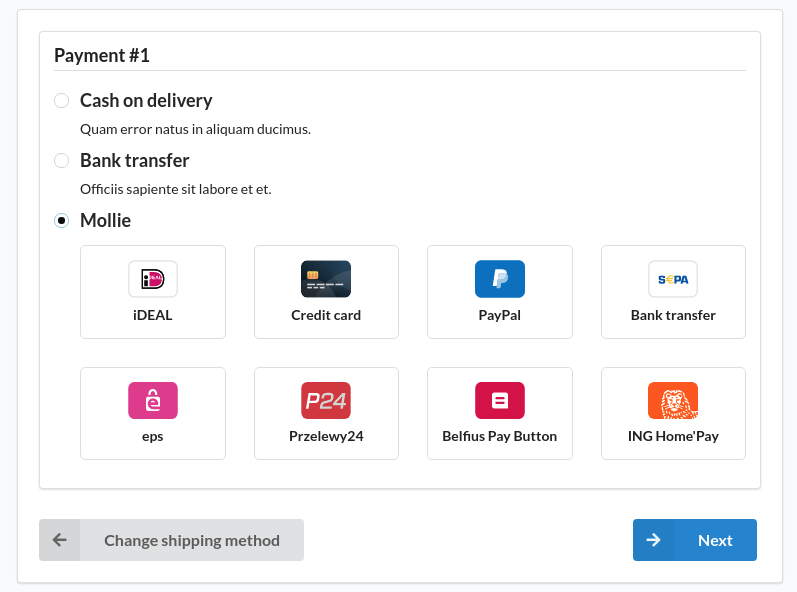
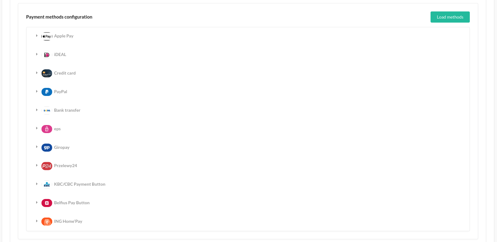
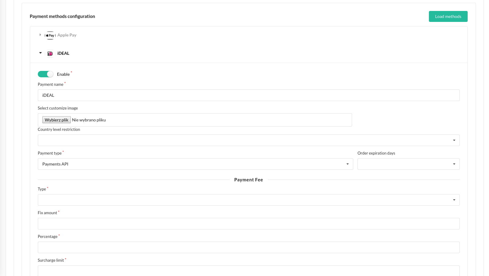

<h1 align="center">
    <a href="http://www.mollie.com" target="_blank">
        
    </a>
    <br />
    <a href="https://packagist.org/packages/bitbag/mollie-plugin" title="License" target="_blank">
        
    </a>
    <a href="https://packagist.org/packages/bitbag/mollie-plugin" title="Version" target="_blank">
        
    </a>
    <a href="http://travis-ci.org/BitBagCommerce/SyliusMolliePlugin" title="Build status" target="_blank">
            
        </a>
    <a href="https://scrutinizer-ci.com/g/BitBagCommerce/SyliusMolliePlugin/" title="Scrutinizer" target="_blank">
        
    </a>
    <a href="https://packagist.org/packages/bitbag/mollie-plugin" title="Total Downloads" target="_blank">
        
    </a>
    <p>
        
    </p>
</h1>







## Overview

Mollie is the most popular (installed over 6000 times) and advanced payment gateway integration with Sylius. Officially certified by Mollie’s team. The integration currently supports the following payment methods:
1. Credit Cards (Master Card, VISA, American Express)
2. PayPal
3. ApplePay
4. Klarna
5. iDEAL
6. SEPA
7. SOFORT
8. EPS
9. Giropay
10. KBC/CBC Payment Button
11. Przelewy24
12. ING Home’Pay
13. Belfius Pay Button
14. Gift cards

Few words from Mollie:
Our mission is to create a greater playing field for everyone. By offering convenient, safe world-wide payment solutions we remove barriers so you could focus on growing your business.

Being authentic is our baseline.

Mollie is one of Europe’s fastest-growing fin-tech companies. We provide a simple payment API, that enables webshop and app builders to implement more than twenty different payment methods in one go. Our packages and plugins are completely open-source, freely available, and easy to integrate into your current project.

Mollie thrives on innovation. When we started we spearheaded the payments industry by introducing effortless payment products that were easier, cheaper, and more flexible than what the rigid, cumbersome banks could do. Now, more than a decade later, trusted by 70.000+ businesses, Mollie is still building innovative products and working hard to make payments better.
## Support

You can order our support on [this page](https://bitbag.io/contact).

We work on amazing eCommerce projects on top of Sylius and other great Symfony based solutions, like eZ Platform, Akeneo or Pimcore.
Need some help or additional resources for a project? Write us an email on mikolaj.krol@bitbag.pl or visit
[our website](https://bitbag.shop/)! :rocket:

## Installation
1.Require with composer

```bash
$ composer require bitbag/mollie-plugin
```

2.Add plugin dependencies to your `config/bundles.php` file:

```php
return [
    ...
    BitBag\SyliusMolliePlugin\BitBagSyliusMolliePlugin::class => ['all' => true],
];
```

3.Import required config in your `config/packages/_sylius.yaml` file:

```yaml
# config/packages/_sylius.yaml

imports:
    ...
    - { resource: "@BitBagSyliusMolliePlugin/Resources/config/config.yaml" }
```

4.Import the routing in your `config/routes.yaml` file:

```yaml
# config/routes.yaml

bitbag_sylius_mollie_plugin:
    resource: "@BitBagSyliusMolliePlugin/Resources/config/routing.yaml"
```

5.Add image dir parameter in _sylius.yaml

```yaml
   parameters:
       images_dir: "/media/image/"
``` 

6.Update your database

```
cp -R vendor/bitbag/mollie-plugin/migrations/* src/Migrations
bin/console doctrine:migrations:migrate
```

7.Copy Sylius templates overridden in plugin to your templates directory (e.g templates/bundles/):

```
mkdir -p templates/bundles/SyliusAdminBundle/
mkdir -p templates/bundles/SyliusShopBundle/

cp -R vendor/bitbag/mollie-plugin/src/Resources/views/SyliusAdminBundle/* templates/bundles/SyliusAdminBundle/
cp -R vendor/bitbag/mollie-plugin/src/Resources/views/SyliusShopBundle/* templates/bundles/SyliusShopBundle/
```

8.Install assets

```
bin/console assets:install
```

9.(optional) if you don't use `symfony/messenger` component yet, it is required to configure default message bus:

```yaml
    framework:
        messenger:
            default_bus: sylius_refund_plugin.command_bus
```

**Note:** If you are running it on production, add the `-e prod` flag to this command.

## Usage
During configuration first, save the keys to the database and then click "Load methods"

### Rendering Mollie credit card form

You can  use `BitBagSyliusMolliePlugin:DirectDebit:_form.html.twig` and `@BitBagSyliusMolliePlugin/Grid/Action/cancelSubscriptionMollie.html.twig` templates for adding the form to supplementing the direct debit card data from and cancel the subscription form the Twig UI.  

For an example on how to do that, take a look at [these source files](tests/Application/templates/bundles/SyliusShopBundle).

## Customization

### Available services you can [decorate](https://symfony.com/doc/current/service_container/service_decoration.html) and forms you can [extend](http://symfony.com/doc/current/form/create_form_type_extension.html)

Run the below command to see what Symfony services are shared with this plugin:
```bash
$ bin/console debug:container bitbag_sylius_mollie_plugin
```

## Recurring subscription

### State Machine

For a better integration with Mollie’s recurring subscription, [you can use state machine callback.](http://docs.sylius.com/en/1.1/customization/state_machine.html#how-to-add-a-new-callback)

Available states:

- Processing: Subscription created but not active yet (startdate higher than “now”)
- Active: Subscription is in progress. Not all payments are done, but we wait until the next payment date
- Cancelled: The merchant cancelled the subscription
- Suspended: Mandates became invalid, so the subscription is suspended
- Completed: All subscription payments are executed according to the timetable

## Testing
```bash
$ composer install
$ cd tests/Application
$ yarn install
$ yarn run gulp
$ bin/console assets:install -e test
$ bin/console doctrine:database:create -e test
$ bin/console doctrine:schema:create -e test
$ bin/console server:run 127.0.0.1:8080 -e test
$ open http://localhost:8080
$ bin/behat
$ bin/phpspec run
```

## Contribution

Learn more about our contribution workflow on http://docs.sylius.org/en/latest/contributing/.
