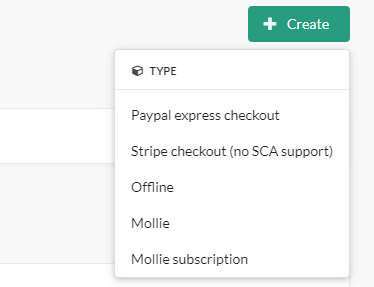
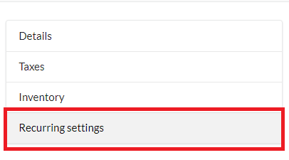
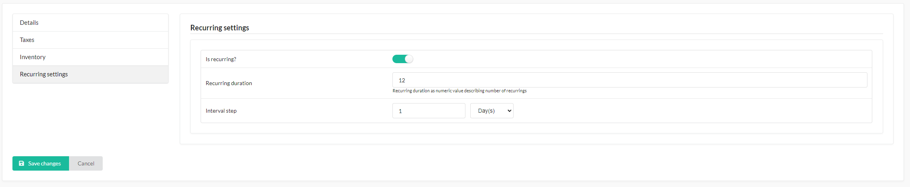
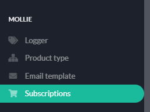
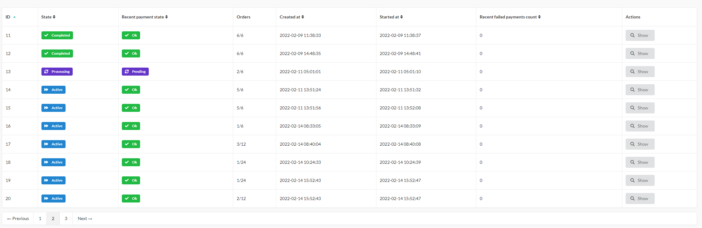
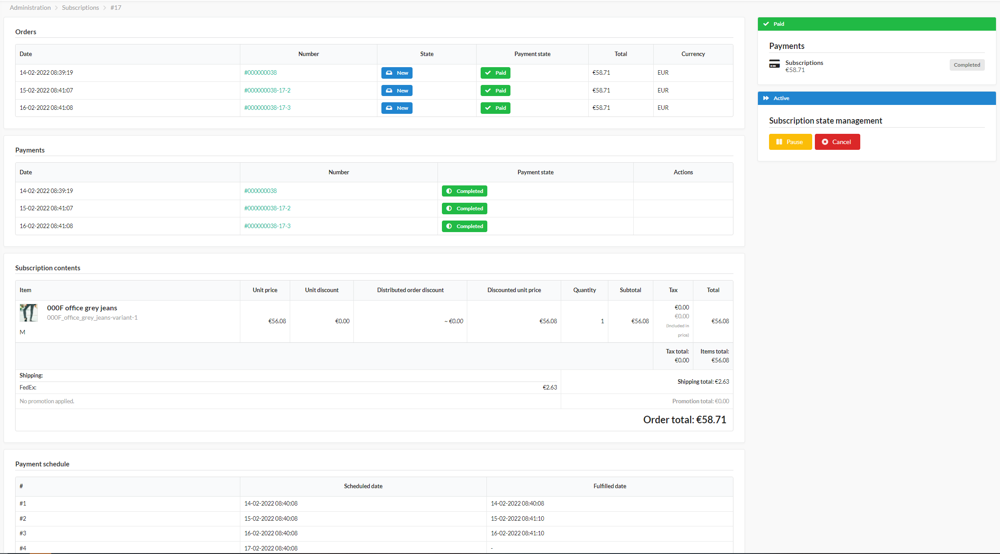
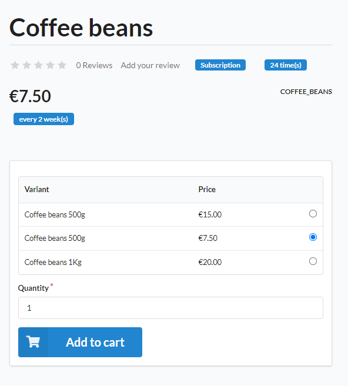

# Recurring payments

This section describes setting up & configuring **recurring** payments with this plugin.

With release **4.0** there's updated version or **recurring** payments gateway available in **payment methods** section within admin panel.


### 1. Configuration
#### 1.1. Cron command
With this functionality added, **CRON** command is required in order to proceed with this version of subscriptions.
```bash
# Mark processable subscriptions, so they won't be re-scheduled multiple times
* * * * * /usr/bin/php /path/to/bin/console mollie:subscription:begin-processing

# Process previously marked subscriptions
* * * * * /usr/bin/php /path/to/bin/console mollie:subscription:processing
```

#### 1.2. Gateway configuration
Configuring **Recurring (cron)** subscriptions has to be configured similarly to "default" Mollie's gateway gateway. 

#### 1.3. Configuring product's variants
In order to use recurring payments there has to be product (variant) that has to exist within order.
In order to configure one's, access any product's variants, and modify it's **Recurring settings**


And then, edit it's settings up to your needs


### 2. Subscriptions
Subscriptions can be accessed in admin by selecting proper menu


Once accessed, there's grid that shows subscriptions and their states


### 2.1. Subscription details
Each subscription contains list of useful information once browsed.

Here's list of every order "attached" to subscription `NOTE: First order may be shared between multiple subscriptions, as it's source of their contents`, every payment, order content's and `expected` payment schedule, and it's fulfilled date.

Every **active / processing** subscription can be **paused**(and **resumed**) or **canceled**

### 3. Orders
Starting from cart, there's requirement, that **recurring** and **non-recurring** cannot exist within **one order**.

Once order's processed, there will be **one subscription each one item (not item-unit)** created, as **intervals and durations** may differ between order's products, and within **schedule** new order will be created every time, when **next** payment should be processed.
This helps individual **refunds** or **partial** subscription **pause** / **cancel**.


### 4. Customisation
By default, this plugin comes with labels, that indicate **subscription** state of product.


However, they may not fit into your template(s). In order to replace them, override of few templates is necesary:

Copy:
* `vendor/bitbag/mollie-plugin/src/Resources/views/Shop/_partial/_recurringBadge.html.twig` into `templates/SyliusMolliePlugin/Shop/_partial/_recurringBadge.html.twig`

Check:
* `vendor/bitbag/mollie-plugin/Resources/views/Shop/_partial/_recurringTranslations.html.twig`
* `vendor/bitbag/mollie-plugin/Resources/views/Shop/Product`
* `vendor/bitbag/mollie-plugin/Resources/views/Shop/Cart`
for more templates to customize.


### 5. Final note
* Every subscription is auto-canceled once `two` payments return `negative` status (timed out / failed).
